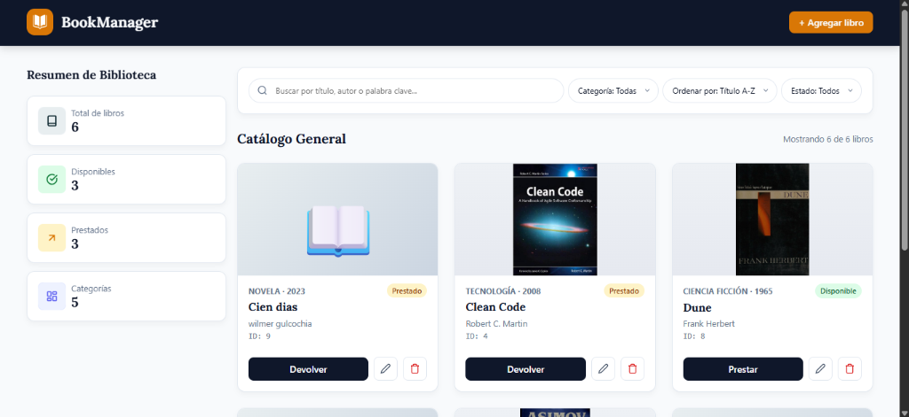
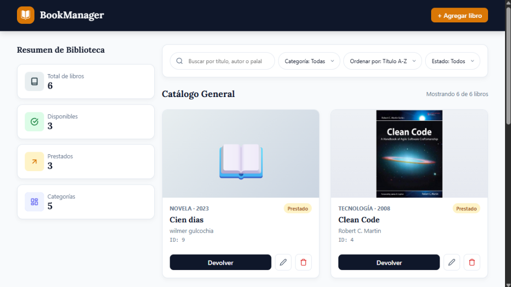
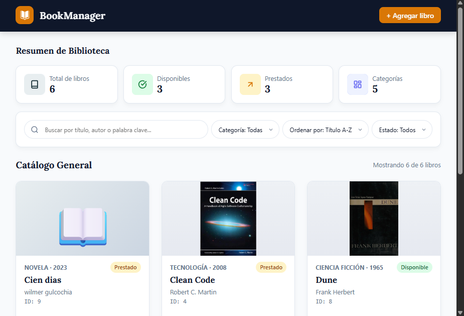
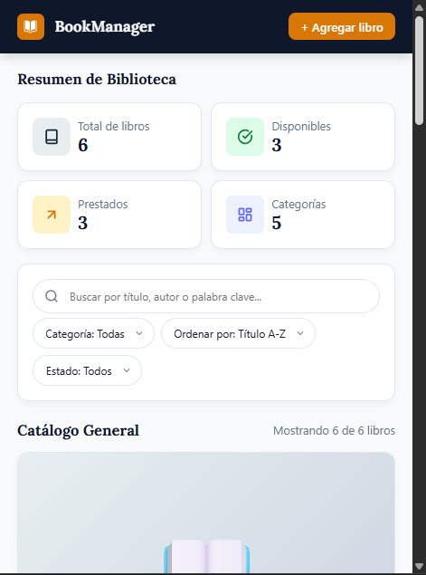

# BookManager

Sistema de gestión de biblioteca digital desarrollado como Single Page Application (SPA) nativa en JavaScript ES6+, HTML5 semántico y CSS3 adaptativo.


---

## Acerca del proyecto

BookManager es una aplicación web interactiva que permite administrar el catálogo de una biblioteca digital en tiempo real. Los usuarios pueden visualizar, agregar, modificar, eliminar, buscar, filtrar y ordenar libros, así como gestionar el estado de préstamo de cada uno.

El proyecto fue desarrollado por el **Grupo G4** como proyecto integrador, enfocado en aplicar fundamentos avanzados de JavaScript Vanilla ES6+: funciones, arreglos, objetos, algoritmos inmutables y manipulación nativa del DOM sin dependencias externas.

---

## Demo en vivo

* **Ver aplicación desplegada:** [https://wigsdev.github.io/gestor-biblioteca-digital/](https://wigsdev.github.io/gestor-biblioteca-digital/)

---

## Capturas del proyecto

### Vista Desktop (Escritorio)


### Vista Laptop (Portátil)


### Vista Tablet


### Vista Mobile (Móvil)


---

## Funcionalidades

| Funcionalidad | Descripción |
| --- | --- |
| Catálogo dinámico | Renderizado eficiente de libros generado con JavaScript usando `DocumentFragment` |
| CRUD completo | Agregar, editar y eliminar libros de forma reactiva en memoria RAM |
| Sistema de préstamos | Conmutación del estado disponible/prestado por libro con badges e iconos dinámicos |
| Buscador en tiempo real | Búsqueda insensible a mayúsculas y acentos (`normalize("NFD")` Unicode) |
| Filtros inmutables | Filtrado por categoría y por estado de disponibilidad usando `.slice()` y `.filter()` |
| Ordenamiento multicriterio | Orden alfabético en español con `localeCompare("es")` y por año de publicación |
| Estadísticas dinámicas | Contadores en tiempo real usando los métodos `reduce()` y `new Set()` |
| Validaciones UI | Formulario validado con mensajes en tiempo real (`input`/`change`) sin uso de `alert()` |
| Responsive Design | Layout adaptado a Desktop, Laptop, Tablet y Mobile con CSS Grid y Flexbox |

---

## Tecnologías

| Tecnología | Uso en el proyecto |
| --- | --- |
| HTML5 | Estructura semántica del documento y accesibilidad ARIA |
| CSS3 | Estilos, CSS Grid, Flexbox, variables en `:root` y Media Queries |
| JavaScript ES6+ | Lógica de negocio, eventos, manipulación del DOM y arquitectura inmutable |
| Git & GitHub | Control de versiones y despliegue continuo en GitHub Pages |

> **Restricciones técnicas:** Desarrollado 100% nativo sin frameworks (React, Vue, Angular), sin librerías externas (jQuery, Bootstrap) y sin bundlers. Cero dependencias `node_modules`.

---

## Instalación y ejecución

### Prerrequisitos

* Un navegador web moderno (Google Chrome, Mozilla Firefox, Microsoft Edge, Safari).
* [Git](https://git-scm.com/) instalado en el sistema.

### Clonar el repositorio

```bash
git clone https://github.com/wigsdev/gestor-biblioteca-digital.git
cd gestor-biblioteca-digital
```

### Ejecutar la aplicación

Al ser un proyecto nativo en JavaScript, no requiere instalación de paquetes ni dependencias `npm`. Abre directamente `index.html` en tu navegador:

```bash
# En macOS
open index.html

# En Linux
xdg-open index.html

# En Windows
start index.html
```

También puedes utilizar la extensión **Live Server** de VS Code haciendo clic derecho sobre `index.html` y seleccionando *Open with Live Server*.

---

## Estructura del proyecto

```
gestor-biblioteca-digital/
├── index.html                   # Página principal (HTML5 semántico)
├── css/
│   └── styles.css               # Estilos globales, variables CSS y responsive
├── js/
│   └── app.js                   # Lógica principal (Funciones, Eventos, DOM, Pipeline)
├── assets/                      # Recursos gráficos del proyecto
│   ├── logo.svg                 # Identotipo del sistema
│   ├── logo-icon-bg.png
│   ├── og-banner.jpg
│   └── capturas/                # Galería de capturas de la interfaz
│       ├── desktop.png
│       ├── laptop.png
│       ├── tablet.png
│       └── mobile.png
├── docs/                        # Documentación del proyecto
│   ├── proyecto-G4.md           # Enunciado original y rúbrica del proyecto integrador
│   ├── backlog.md               # Product Backlog con el desglose de tareas
│   ├── workflow.md              # Convenciones de Git y flujo de trabajo
│   ├── guia-desarrollo.md       # Guía de selectores, IDs y estructura HTML
│   └── revision-diseno.md       # Notas y revisiones del diseño de interfaz
├── package.json                 # Configuración del proyecto
├── LICENSE                      # Licencia MIT oficial
└── README.md                    # Documentación principal
```

---

## Equipo de desarrollo (Grupo G4)

| Rol | Nombre | Usuario GitHub |
| --- | --- | --- |
| Team Leader / Dev | Wilmer Gulcochía Sánchez | [@wigsdev](https://github.com/wigsdev) |
| Developer | Miriam Hortencia Huamán Ayala | [@Miriamhha](https://github.com/Miriamhha) |
| Developer | Javier Flores Encarnación | [@JavierFloresenc](https://github.com/JavierFloresenc) |
| Developer | Rosmery Del Pilar Medina Linares | [@rousmedina](https://github.com/rousmedina) |
| Developer | Víctor Daniel Dávila Sánchez | [@danieldaviladev](https://github.com/danieldaviladev) |
| Developer | Marco Antonio Chile Andrade | [@marcochile](https://github.com/marcochile) |

---

## Documentación del repositorio

* **[Enunciado del Proyecto](./docs/proyecto-G4.md)** — Requerimientos y especificaciones del proyecto integrador.
* **[Product Backlog](./docs/backlog.md)** — Tareas, prioridades y criterios de aceptación.
* **[Workflow y Convenciones](./docs/workflow.md)** — Reglas de branching, Conventional Commits y Pull Requests.
* **[Guía de Desarrollo](./docs/guia-desarrollo.md)** — Guía de estilos, IDs, clases y selectores DOM.
* **[Revisión de Diseño](./docs/revision-diseno.md)** — Especificaciones y revisión del diseño UI.

---

## Roadmap

- [x] Planificación, arquitectura de software y Product Backlog.
- [x] Estructura semántica HTML5 y tokens de diseño CSS3.
- [x] Operaciones CRUD en memoria RAM (Agregar, Editar, Eliminar, Préstamos).
- [x] Búsqueda flexible insaciable a tildes, filtros inmutables y ordenamiento.
- [x] Delegación de eventos, pipeline de control e integración de `DOMContentLoaded`.
- [x] Despliegue en vivo en GitHub Pages y documentación completa.

---

## Licencia

Distribuido bajo la Licencia MIT. Ver el archivo [LICENSE](./LICENSE) para más detalles.
